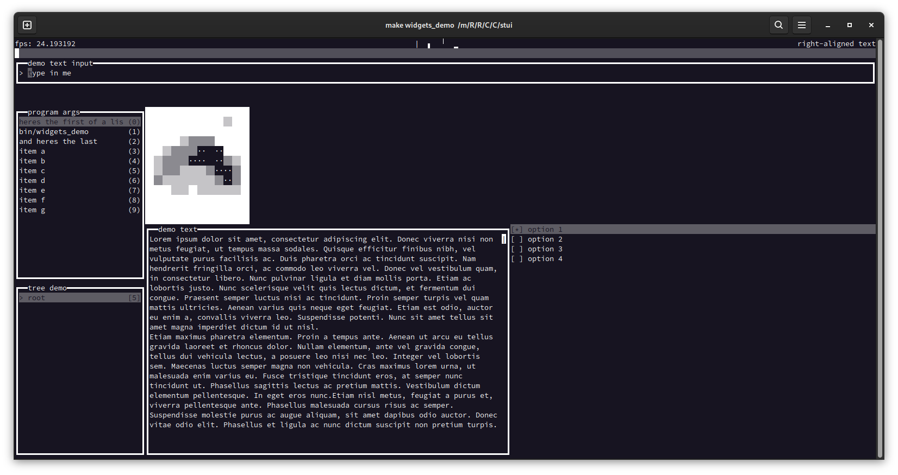

# stui - Simple Text UI

a lightweight, easy-to-use, header-only, semi-immediate-mode TUI framework for building simple interfaces, inside the terminal, across platforms.

## Key Features

_the project i developed this library for, my FBX file debug tool_

- **cross-platform** - tested on Windows and Linux (including WSL)
- **lightweight** - simple components and code architectured with efficiency in mind, including giving you tools to limit your framerate and only redraw when necessary
- **immediate-mode** - you can draw the screen, and check for input whenever and wherever you want
- **callback-driven interaction** - callback functions make it easy to add interactivity
- **extensible** - lacking a particular UI element you want? add it yourself by subclassing `Component`
- **header-only** - no extra compiler options, no extra DLLs you need to ship, it all just builds into a single executable
- **supports Unicode glyphs** - assuming your terminal can display them, `Component`s can draw Unicode characters (e.g. for boxes, spinners, etc)
- **modular** - manage you UI behaviour manually, or use the `Page` extension to handle `Component` management and focus for you. if you want to write your UI as a separate script file, `LayoutReader` does that. you're free to pull in the extra modules if you need them

_TUI-driven compiler tool to demonstrate widgets and callbacks. see compiler_tool.cpp_

_showing off most of the available widgets. see widgets_demo.cpp_

## Purpose

i started writing a tool for debugging FBX files, and i wanted to have a little UI for it displayed in the terminal so you could browse the NodeRecord tree. since i couldn't seem to find any decent, easy-to-use TUI frameworks (my main requirements being header-only and cross-platform), *un*fortunately this cast me into a rabbit hole of building my own library to do that. and now you have this project.

the project concept was partly inspired by [gitui](https://github.com/extrawurst/gitui), an excellent text UI program for git, which i also used extensively while developing this.

## Status

i'm probably finished with developing this project. it's reasonably complete and documented as it is. i've finished developing LayoutScript, my scripting language extension for building UIs, and i don't want to overcomplicate the project too much or just bloat it with unecessary stuff (any further than it already is).

if there's something (like an additional `Component`) you'd really like to see added, or something you've added that you want merged, i'll look into it.

if there is a bug that needs fixing, or something missing, please submit an issue and i'll endeavour to address it.

## Installation and Usage

see the [HELP.md](doc/HELP.md) file for a proper explanation, but all you need to do is `git submodule add` this project (or just clone it separately and keep the `inc` directory somewhere handy) and add the `inc` directory as an include path for your compiler. then you're good to go with creating UI elements and drawing them in the terminal. _happy widgeting!_

Copyright (C) 2024-2025  Jacob Costen
